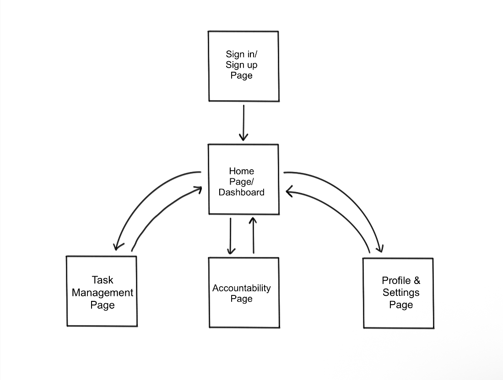

## Motivation
### Problem Statement
Procrastination is a widespread challenge, affecting over 80% of college students. It often results in late submissions, poor grades, and unnecessary stress.  While many productivity apps aims to address this issue, they are often abandoned when the initial motivation begins to fade. Most existing apps fail to provide a form of social accountability and engaging ways to set and track goals.

### Solution Statement
Our app aims to reduce procrastination by combining task management with social accountability. Users can set goals, track their progress, and check on their peer's progress. By including collaborative elements and progress visualization, the app encourages users to remain consistent and create productive habits. It also encourages the users to keep their friends accountable in a fun and unique way. 

## Technical Stack

|   |   |
|--------|--------|
| Platform | iOS |
| IDE | XCode |
| Programming language | Swift |
|Libraries/Framework | SwiftUI |

## App Structures & Feautures

### Basic User Flow

- Home Dashboard
  - Displays current tasks/goals
  - Shows overview of progress
- Profile & Settings
  - Make edits to profile
  - Add friends
  - Notification controls
- Task Management
  - Create, edit, and delete tasks
  - Set deadlines
  - Mark tasks as complete
- Accountability Feautures
  - Personal streak
  - Shared streak with friends
  - Overview of friend's progress
- Notifications
  - Productivity check ins
 
